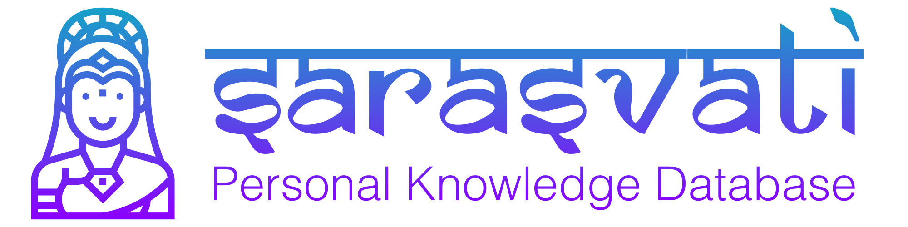

    

 

Sarasvati is a personal knowledge database. It starts with a single Thought and grows more powerful as you use it. Think of it as a living mind map with unlimited space for everything you want, are learning or need to remember. Each idea can grow and evolve with all related Thoughts instead of being separated in folders or lists. Use Sarasvati to manage specific projects or as an “everything in your life manager” to get the big picture on your ideas and find the right information in seconds.

## Features
1. **Unlimited mindmap**. There are a lot of connections in your head, but unfortunately, sometimes they don't last. With Sarasvati, your digital Brain captures all that intelligence for playback just when you need it.
2. **All your data belongs to you**. Sarasvati uses open formats so you can export all your data anywhere.
